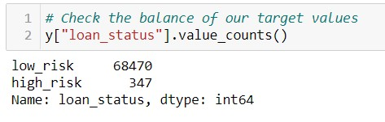
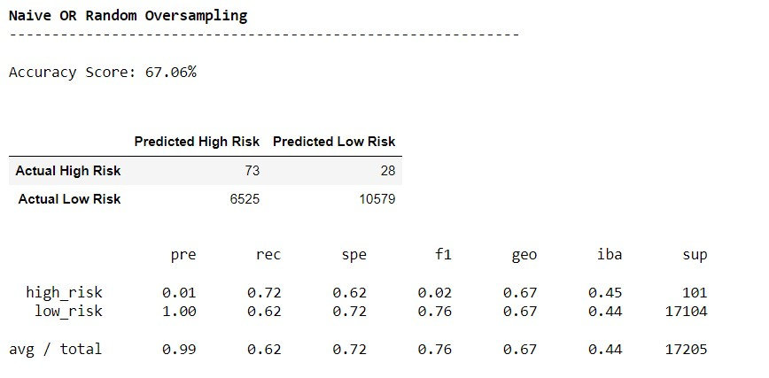

# Credit_Risk_Analysis!

## Overview & Purpose
Credit risk is an inherently unbalanced classification problem, as good loans easily outnumber risky loans. Therefore, you’ll need to employ different techniques to train and evaluate models with unbalanced classes. We will use <ins>imbalanced-learn</ins> and <ins>scikit-learn</ins> libraries to build and evaluate models using resampling.

Using the credit card credit [dataset](Resources/LoanStats_2019Q1.csv) from **LendingClub**, and then apply different models as mentioned below to figure out which fits the best.

* Oversample the data using the [RandomOverSampler] and SMOTE algorithms.
* Undersample the data using the ClusterCentroids algorithm.
* Use a combinatorial approach of over- and undersampling using the SMOTEENN algorithm.
* Compare two machine learning models that reduce bias, BalancedRandomForestClassifier and EasyEnsembleClassifier.
* We will evaluate the performance of these models and make a recommendation on whether they should be used to predict credit risk.

## How do we determine which model is good fit ?
Here is little descriptions of what these parameters we would be looking for comparison.

### Metrics that measure model’s performance
* <ins>Confusion matrix</ins> – table that describes how well a classification performs on a set of test data.
* <ins>Accuracy</ins> – The percentage of accurate predictions for the test results is known as accuracy in ML.
* <ins>Recall</ins> – The proportion of examples predicted to belong to a class compared to all of the examples that actually belong in the class is known as recall.
* <ins>Precision</ins> – Precision is classified as the percentage of relevant examples (true positives) among all the examples predicted to belong in a given class.

## Results
The dataset had around 68478 low risk loan applications and 347 low risk loan applications.

 

### 1 Naive Random Oversampling Classification Report

 

* Accuracy Score is 

## Resouces
https://deepchecks.com/glossary/machine-learning-model-accuracy/
