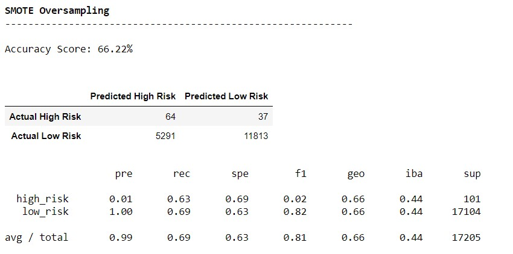
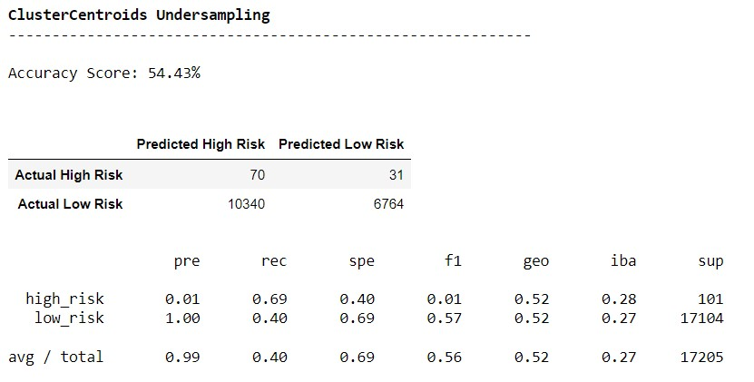
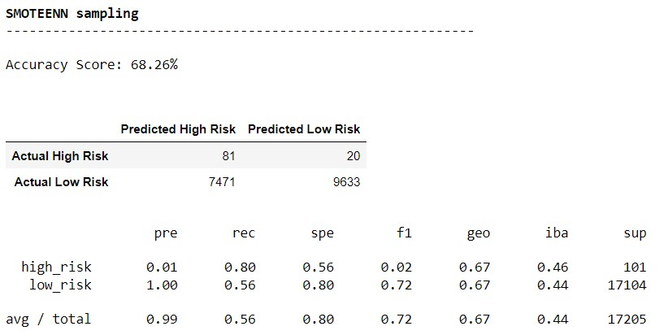
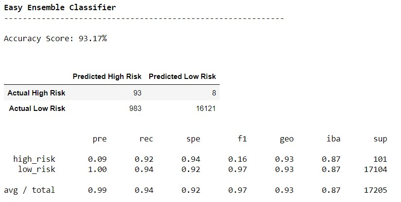

# Credit_Risk_Analysis!

## Overview & Purpose
Credit risk is an inherently unbalanced classification problem, as good loans easily outnumber risky loans. Therefore, you’ll need to employ different techniques to train and evaluate models with unbalanced classes. We will use <ins>imbalanced-learn</ins> and <ins>scikit-learn</ins> libraries to build and evaluate models using resampling.

Using the credit card credit [dataset](Resources/LoanStats_2019Q1.csv) from **LendingClub**, and then apply different models as mentioned below to figure out which fits the best.

* Oversample the data using the [RandomOverSampler](#1-Naive-or-Random-Oversampling-Classification-Report) and [SMOTE](#2-SMOTE-OverSampling) algorithms.
* Undersample the data using the [ClusterCentroids](#3-ClusterCentroids-UnderSampling) algorithm.
* Use a combinatorial approach of over- and undersampling using the [SMOTEENN](#4-SMOTEENN-Sampling) algorithm.
* Compare two machine learning models that reduce bias, [BalancedRandomForestClassifier](#5-Balanced-Random-Forest-Classifier) and [EasyEnsembleClassifier](#6-EASY-Ensembler-Classifier).
* We will evaluate the performance of these models and make a recommendation on whether they should be used to predict credit risk.

## How do we determine which model is good fit ?
Here is little descriptions of what these parameters we would be looking for comparison.

### Metrics that measure model’s performance
* <ins>Confusion matrix</ins> – table that describes how well a classification performs on a set of test data.
* <ins>Accuracy</ins> – The percentage of accurate predictions for the test results is known as accuracy in ML.
* <ins>Recall</ins> – The proportion of examples predicted to belong to a class compared to all of the examples that actually belong in the class is known as recall.
* <ins>Precision</ins> – Precision is classified as the percentage of relevant examples (true positives) among all the examples predicted to belong in a given class.
* <ins>F1-score</ins> - F1 score is defined as the harmonic mean between precision and recall. It is used as a statistical measure to rate performance. In other words, an F1-score (from 0 to 9, 0 being lowest and 9 being the highest) is a mean of an individual's performance, based on two factors i.e. precision and recall.
  
## Results
The dataset had around 68478 low risk loan applications and 347 low risk loan applications.

 

### 1 Naive or Random Oversampling Classification Report

 

In the above summary we notice:

* **Accuraccy Score** is 67%, which may not be much reliable model to go for.
* **Precesion** for Low risk is 100% which is good (means for low risk the predication is perfect), however Precision for **High Risk** loans(which is more important) is just 1% (means only 1% of data is correctly predicated.).This is alarming as for High Risk loans we would like to have more precision. 
* **Recall** for High risk 72%. (means 72% of the high risk loans were predicted as low risk.)
* **F1 score** is very low for High Risk loans ie 1% (Harmonic Mean being low means precision and recall are too apart. The performance of this model is low.

### 2 SMOTE OverSampling

 

In the above summary we notice:

* **Accuraccy Score** is 66%, which may not be much reliable model to go for.
* **Precesion** for Low risk is 100% which is good (means for low risk the predication is perfect), however Precision for **High Risk** loans(which is more important) is just 1% (means only 1% of data is correctly predicated.).This is alarming as for High Risk loans we would like to have more precision. 
* **Recall** for High risk 69%. (means 69% of the high risk loans were predicted as low risk.)
* **F1 score** is very low for High Risk loans ie 2% (Harmonic Mean being low means precision and recall are too apart.) The performance of this model is not great.

### 3 ClusterCentroids UnderSampling

 

In the above summary we notice:

* **Accuraccy Score** is 54%, which is not much reliable model to go for.
* **Precesion** for Low risk is 100% which is good (means for low risk the predication is perfect), however Precision for **High Risk** loans(which is more important) is just 1% (means only 1% of data is correctly predicated.).This is alarming as for High Risk loans we would like to have more precision. 
* **Recall** for High risk 69%. (means 69% of the high risk loans were predicted as low risk.)
* **F1 score** is very low for High Risk loans ie 1% (Harmonic Mean being low means precision and recall are too apart.) The performance of this model is low.

### 4 SMOTEENN Sampling

 

In the above summary we notice:
* **Accuraccy Score** is 68%, which may not be much reliable model to go for.
* **Precesion** for Low risk is 100% which is good (means for low risk the predication is perfect), however Precision for **High Risk** loans(which is more important) is just 1% (means only 1% of data is correctly predicated.).This is alarming as for High Risk loans we would like to have more precision. 
* **Recall** for High risk 80%. (means 80% of the high risk loans were predicted as low risk.) Its better coverage compared to other models.
* **F1 score** is very low for High Risk loans ie 2% (Harmonic Mean being low means precision and recall are too apart.) The performance of this model is low.

### 5 Balanced Random Forest Classifier

 

In the above summary we notice:
* **Accuraccy Score** is 78%, which may likely reliable model to go for.
* **Precesion** for Low risk is 100% which is good (means for low risk the predication is perfect), however Precision for **High Risk** loans(which is more important) is just 3% (means only 3% of data is correctly predicated.).This is little better compared to other models for High Risk loans. However, we would like to have more precision. 
* **Recall** for High risk 70%. (means 70% of the high risk loans were predicted as low risk.)
* **F1 score** is very low for High Risk loans ie 6% (Harmonic Mean being low means precision and recall are too apart.) The performance of this model is low but better than previous models.

### 6 EASY Ensembler Classifier

 

In the above summary we notice:
* **Accuraccy Score** is 93%, which is the best score so far and the most reliable model to go for.
* **Precesion** for Low risk is 100% which is good (means for low risk the predication is perfect), AS WELL Precision for **High Risk** loans(which is more important) is 9% (means only 9% of data is correctly predicated.).This is performing better compared to other models for High Risk loans. However, we would like to have more precision. 
* **Recall** for High risk 92%. (means 92% of the high risk loans were predicted as low risk.) This means we can correct 92% of data and that is good to know.
* **F1 score** is very low for High Risk loans ie 16% (Harmonic Mean being 16% means precision and recall are too apart.) The performance of this model is the best so far.

### Summary
Here is a summary of all the models we discussed above

From the above comparision its clear that EASY Ensembler Classifier gives the best results and gives the most accuracy score.

## Resouces
https://deepchecks.com/glossary/machine-learning-model-accuracy/
